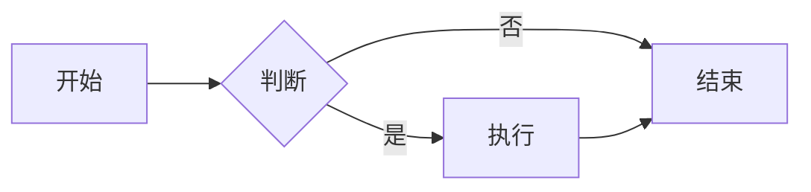
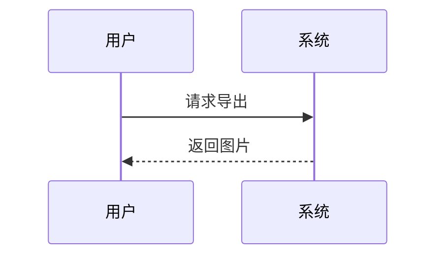
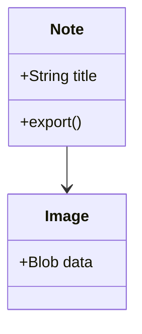
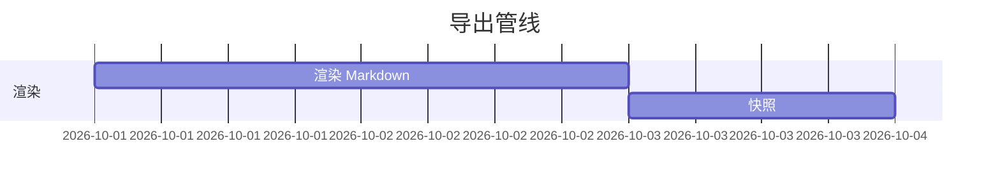
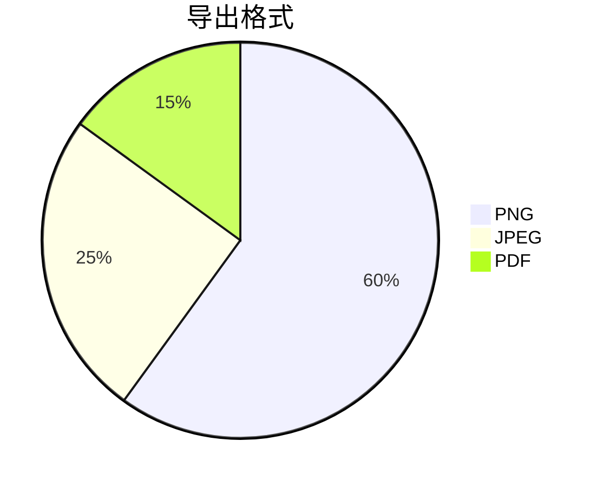

# Mermaid / Pele 基线

## 流程图

```mermaid
flowchart LR
  A[开始] --> B{判断}
  B -->|是| C[执行]
  B -->|否| D[结束]
  C --> D
```

## 时序图

```mermaid
sequenceDiagram
  participant 用户
  participant 系统
  用户->>系统: 请求导出
  系统-->>用户: 返回图片
```

## 类图

```mermaid
classDiagram
  class Note {
    +String title
    +export()
  }
  class Image {
    +Blob data
  }
  Note --> Image
```

## 状态图

```mermaid
stateDiagram-v2
  [*] --> 编辑
  编辑 --> 预览
  预览 --> 导出
  导出 --> [*]
```

## 甘特图

```mermaid
gantt
  title 导出管线
  dateFormat YYYY-MM-DD
  section 渲染
  渲染 Markdown :a1, 2026-10-01, 2d
  快照          :a2, after a1, 1d
```

## 饼图

```mermaid
pie title 导出格式
  "PNG" : 60
  "JPEG" : 25
  "PDF" : 15
```
